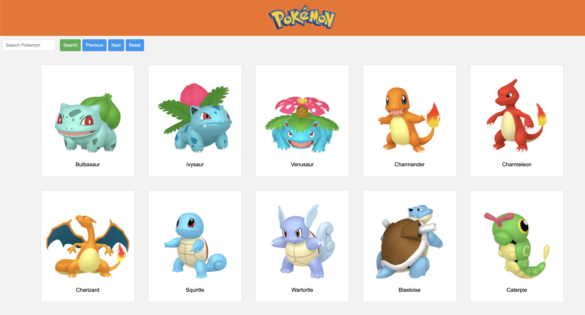

# Creación de una Pokédex con HTML, CSS y JavaScript

En este ejercicio, construiremos una Pokédex básica utilizando HTML, CSS y JavaScript. La Pokédex mostrará una lista de Pokémon obtenidos de la API pública de Pokémon. Los usuarios podrán navegar entre las páginas de Pokémon, buscar Pokémon específicos y ver detalles básicos de cada uno.

FYI: La pokedex es el listado de todos los pokemon con sus nombres e imagenes. Puedes añadir más cosas si quieres.

## Pasos del Ejercicio

### Paso 1: Estructura HTML
- El HTML ya está creado `index.html`. Tiene cosas básicas para empezar.

### Paso 2: Estilo CSS
- Ya está creadas las CSS básicas `style.css`.
- Personaliza los estilos según tus preferencias.

### Paso 3: Lógica JavaScript
- En `script.js` harás toda la lógica del programa.
- La URL base es la siguiente `https://pokeapi.co/api/v2/pokemon`
- Implementa la lógica para interactuar con la API de Pokémon.
- Gestiona la paginación para mostrar diferentes conjuntos de Pokémon. De 10 en 10. añadir esto a la url más otras cosas puede limitar la cantidad `?limit=`
- Permite la búsqueda de Pokémon por nombre. Si no exite deberá aparecer un mensaje de "pokemon no encontrado"
- Mira como aceder al pokemon por nombre en la documentación.
- Maneja eventos de botones y actualiza dinámicamente la interfaz.
- aquí la documentación de pokemon `https://pokeapi.co/docs/v2`

### Paso 4: Mejoras Adicionales
- Agrega estilos adicionales.
- Mejora la interactividad de la aplicación.
- Personaliza la presentación de la información de Pokémon.

debe quedar algo similar a esto:

### BONUS
- Crea una segunda página donde se guarden tus pokemon favoritos.
- Al clickar en un pokemon en index.html este tendrá que guardarse en localStorage y en la otra página saldrán esos pokemon que se han guardado previamente
- Cada pokemon, si se ha añadido a favoritos `localStorage`, tendrá que tener una marca como que ya está añadido. Si se vuelve a clickar desaparcera la marca y de favoritos `localStorage`
- Puedes usar un script nuevo que solo traiga esos pokemon de favoritos